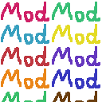

# ModpackLoaderFabric
Using this mod makes it very easy to download a ton of mods from a list of modpacks and keep them up to date.

## Dependencies
None of these are required, they just add a user-interface for selecting mods.
*These will be automatically downloaded at first launch, restart the game to apply*
- [Fabric API](https://modrinth.com/mod/fabric-api)
- [Modmenu](https://modrinth.com/mod/modmenu)
- [Cloth Config API](https://www.curseforge.com/minecraft/mc-mods/cloth-config)

## Usage
This mod uses the JSON format to store which mods to download and keep up to date. On startup, it searches [Modrinth](https://modrinth.com/mods) and [CurseForge](https://www.curseforge.com/minecraft/mc-mods) to see if a new version of the mods are available. If that is the case, *ModpackLoderFabric* will download the new version and delete the old version of the mod. If you had a mod installed before using *ModpackLoderFabric*, it will rename that mod to  `modname.jar.old`.
By default, the mod checks for updates only once a day to reduce startup time.

You can still add other mods manually, *ModpackLoaderFabric* will only automatically update your selected mods. **All mods downloaded by _ModpackLoaderFabric_ come with the suffix `modname_MPLF.jar`**

**⚠Unfortunately you have to manually restart the game to apply the newly downloaded mods, as reloading mods is impossible from within the game**

### Modpack from repository
The easiest method at the moment is to use my repository at [wolfii.me](https://modpacks.wolfii.me). You can access all the modpacks from the config screen in modmenu under `Hosted Modpacks`.
Uploading modpacks to this website to make them publicly available will be possible soon.

### Modpack from local file
If you want to create your own modpack, you can simply do so by creating a file in your /config/MPLF_Modpacks and selecting it from the config screen under `Local Modpacks`. This file format has to match [the modpack format](#modpack-format).

### Modpack from external URL
Lastly, it is also possible to add a modpack by URL. This is done in the `External Modpacks` panel in the config screen. Modpacks added this way also have to match [the modpack format](#modpack-format).

## Config
- `Check for updates on game start` - Disabling this option prevents the mod from making any further changes to your mods folder.
- `Update interval` - This option allows you to customize how often *ModpackLoaderFabric* will check for updates. Setting this to 0 (not recommended, launching takes a while) will check for mod updates on every game launch.
- `Force update on next start` - After selecting a new modpack it is recommended to also check this option as well, as the mod will probably skip update checking by default due to the **update interval**.
- `Update on "Save & Quit"` - This will immediately install or update your selected modpacks, this will take a while. Restart your game to apply the new mods.


## Modpack format
The modpacks have to be stored in a JSON format
```json
{
    "modrinth": {
        "versions": ["1.18.2", "1.18.1", "1.18"],
        "mods": ["P7dR8mSH"]
    },
    "curseforge": {
        "versions": "73250",
        "mods": ["308702"]
    },
    "description": "Example Modpack"
}
```
* `mods`: A JSON array of mod IDs from the selected platform.
* Modrinth-`versions`: A JSON array of the Minecraft versions that will be searched for.
* CurseForge-`versions`: A string of which Minecraft version will be searched for [(`73250` = 1.18-1.18.2)](https://github.com/JustAlittleWolf/modpackLoaderFabric/blob/main/curseForgeVersions.json).
* `description`: This text will show up when hovering over the modpack in the settings menu.

#### Mod-ID on Modrinth


#### Mod-ID on CurseForge

